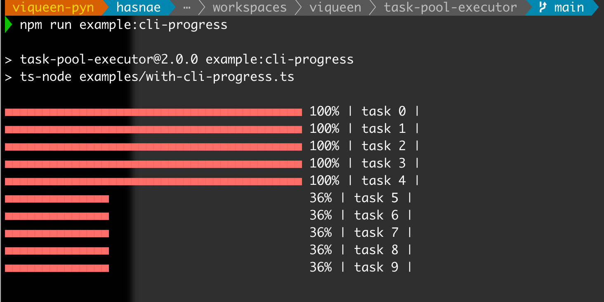

## task-pool-executor

[](https://sonarcloud.io/dashboard?id=viqueen_task-pool-executor)
[](https://snyk.io/test/github/viqueen/task-pool-executor?targetFile=package.json)

---

Provides a **simple** and a **cli progress** executor implementations to orchestrate a set of
asynchronous tasks

### install it

- **npm**

```bash
npm install task-pool-executor --save
```

- **yarn**

```bash
yarn add task-pool-executor
```

### use it

- simple task executor

```typescript
import { taskPoolExecutor } from "task-pool-executor";

const executor = taskPoolExecutor<string>({ maxConcurrent: 3 });
const task = {
  title: "my-task",
  run: () => Promise.resolve("done"),
};
executor.submit(task);

await executor.close();
```

- with cli progress support

```typescript
import {
  CliProgressRunContext,
  cliProgressTaskPoolExecutor,
} from "task-pool-executor";

const taskPool = cliProgressTaskPoolExecutor<string>();

const delayedTask = (millis: number, title: string) => {
  const run = (ctx?: CliProgressRunContext) =>
    new Promise<string>((resolve) => {
      const interval = setInterval(() => {
        ctx?.progress.increment();
      }, 8);
      const timeout = setTimeout(() => {
        clearInterval(interval);
        resolve("done");
      }, millis);
    });
  return { title, run };
};

const tasks = new Array(10)
  .fill(0)
  .map((_v, index) => delayedTask(2000, `task ${index}`));

const internal = async () => {
  tasks.forEach((t) => taskPool.submit(t));
  await delayedTask(8000, "running").run();
  await taskPool.close();
};

internal().then(console.info).catch(console.error);
```


